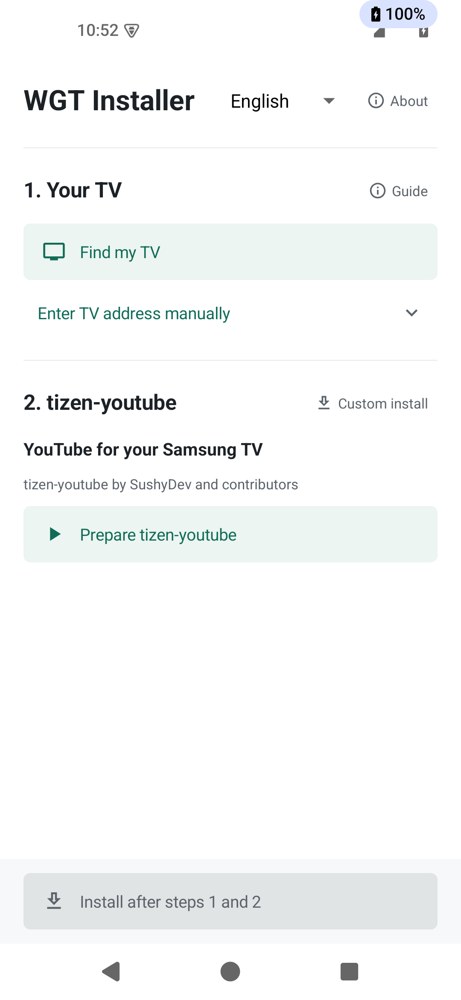
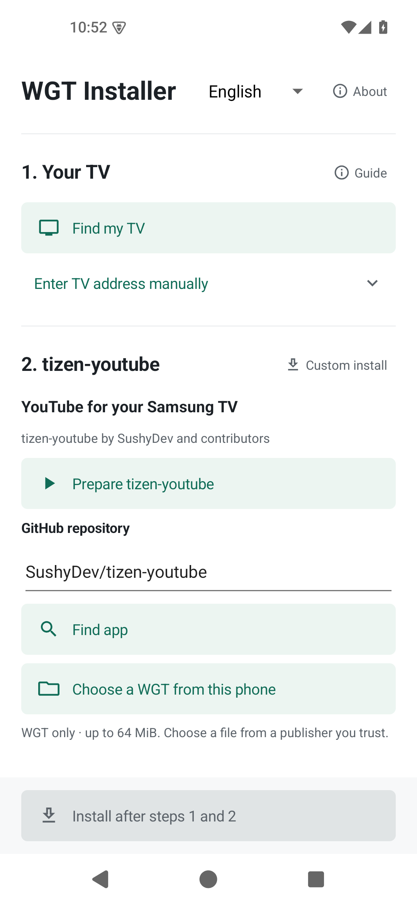
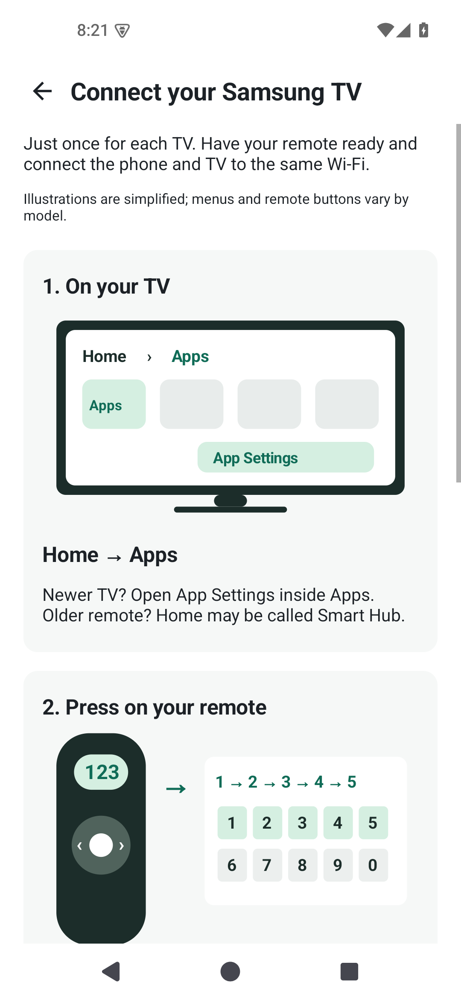
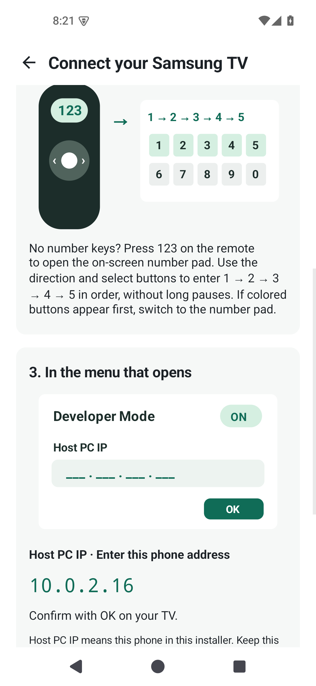

# Android Tizen WGT Installer

**Install [tizen-youtube](https://github.com/SushyDev/tizen-youtube) on your Samsung TV from your Android phone.**

No PC, Termux, or TV-side Homebrew service needed.

Made possible by the work of **SushyDev, reisxd, the Apps2Samsung authors, and the Tizen homebrew community**. See [Inspiration and credits](#inspiration-and-credits) for implementation sources and related projects.

**[Download the APK](https://github.com/Readiz/android-tizen-wgt-installer/releases/latest)** · Android 8.0+ · English / Korean

  
  

## Project focus

[Apps2Samsung for Android](https://github.com/Apps2Samsung/Apps2Samsung) already provides phone-based TV discovery, Samsung certificate handling, signing, and installation without a PC or Termux. It is the closest existing alternative; the core installation flow overlaps substantially with this project.

Our focus is a simple default: **find your TV → prepare tizen-youtube → install**. Other repositories and local WGT files are available under **Custom install**, so they stay out of the main flow. Kotlin/JCA is our implementation choice, not evidence of better speed, reliability, or compatibility. Simplifying this flow is the goal; a usability advantage has not yet been measured in a comparison on the same TV.

For a community catalog, custom package installation, and broader TV management, see Apps2Samsung. See our [development direction](docs/ARCHITECTURE.md#development-direction) for priorities and comparison criteria.

## Get started

1. **Find your TV.** Connect your phone and Samsung TV to the same Wi-Fi, then tap **Find my TV**. For first-time setup, tap **Guide** beside **1. Your TV** to open the illustrated guide.
2. **Prepare tizen-youtube.** Tap **Prepare tizen-youtube**, then choose **5.5 for 2020 or newer models**, or **5.0 for 2019 models** ([Samsung model-year reference](https://developer.samsung.com/smarttv/develop/specifications/tv-model-groups.html)). No repository address is needed.
3. **Install.** Confirm that you trust the publisher, then tap **Install after steps 1 and 2**. If prompted, tap **Sign in** to open Samsung login in your browser.

**Other apps (optional):** tap **Custom install** beside **2. tizen-youtube** to enter a different public GitHub repository or choose a `.wgt` file from your phone. Files are limited to 64 MiB; local files require explicit trust in their source. English is the default; switch to Korean from the top menu.

First-time TV setup: the 12345 menu

1. On the TV, open **Home / Smart Hub → Apps**. On newer TVs, open **App Settings**.
2. Enter **12345** on the remote. No number keys? Press **123** to use the on-screen keypad.
3. Turn **Developer Mode ON** and set **Host PC IP** to the phone address shown in the app. Confirm with **OK**.
4. Hold the remote power button until the TV turns off and restarts, then find it in the app. If it still cannot connect, unplug the TV for 10–15 seconds and reconnect it.

Keep Host PC IP set to your phone. Update it if the phone's address changes.

The app guide uses original vector diagrams, including the remote **123** button and the on-screen number pad.

Guide reference: [Samsung Developer — TV device setup](https://developer.samsung.com/smarttv/develop/getting-started/using-sdk/tv-device.html).

> Experimental debug APK; compatibility depends on your TV and the app. Keep this installer and its data to preserve the signing keys needed for future updates.

## Inspiration and credits

The Kotlin implementation adapts protocol and signing conventions from Tizen Homebrew and tizen.js, and draws on the additional references below. Thank you to their original authors and contributors for sharing the work that made this installer possible.

- **[Tizen Homebrew](https://github.com/SushyDev/tizen-homebrew) — SushyDev and contributors.** A foundation for this implementation: its SDB transport, file transfer and installation sequence, WGT signature format, certificate issuance flow, and GitHub release selection informed the Kotlin implementation.
- **[tizen.js](https://github.com/reisxd/tizen.js) — reisxd and contributors.** A source for the Samsung certificate workflow, including CSR fields, certificate authority retrieval, and issuance API conventions.
- **[Apps2Samsung](https://github.com/Apps2Samsung/Apps2Samsung) — the Apps2Samsung authors and contributors.** Direct prior work on a standalone Android installer with certificate provisioning, signing, and an in-process SDB engine. It is our primary product comparison and also informed our TV setup guide.
- **[TizenBrew](https://github.com/reisxd/TizenBrew) and [TizenBrew Installer](https://github.com/reisxd/TizenBrewInstaller) — reisxd and contributors.** References for the Tizen homebrew ecosystem, developer setup, Samsung certificate requirements, and SDB installation commands.
- **[tizen-youtube](https://github.com/SushyDev/tizen-youtube) — SushyDev and contributors.** The app used in our installation example and compatibility testing; its documentation guided WGT version selection and comparison of certificate-based installation paths. The app itself is the work of its upstream authors.

[tizen-youtube's own installation guide](https://github.com/SushyDev/tizen-youtube/blob/main/docs/README.md#apps2samsung-with-a-partner-certificate) already lists Apps2Samsung with a Partner certificate. Tizen Homebrew's TV-hosted design is a separate architectural choice; it does not imply that its authors were unaware of phone-based alternatives. Additional Android SDB and Termux precedents are recorded in [Source traceability](docs/SOURCES.md#2026-10-01--android-installer-positioning-review).

Please visit and support the original projects. File-level source references and recorded blob hashes are in [Source traceability](docs/SOURCES.md); attribution and license notices are in [NOTICE](NOTICE). This is an independent project, with no endorsement implied from the upstream authors.

[Build](docs/BUILDING.md) · [Architecture](docs/ARCHITECTURE.md) · [Security](docs/SECURITY.md) · [Test results](docs/TEST_REPORT.md) · [Credits](NOTICE)

GPL-3.0-only · [License](LICENSE) · Unofficial; not affiliated with Samsung.
